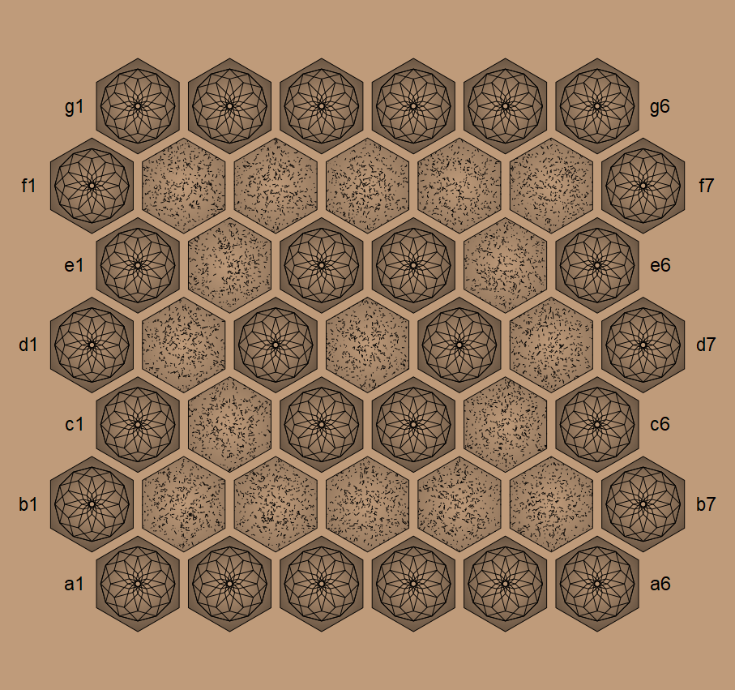

# Pijersi-SVG
This repository provides:

- A Python program that draws SVG pictures for the Pijersi boardgame : the board and the cubes.
- SVG pictures for making a Pijersi boardgame set.

See also the following  [**LICENSE**](./docs/LICENSE.txt) and  [**COPYRIGHT**](./docs/COPYRIGHT.md)  documents. 

The rules of Pijersi boardgame are explained here [https://github.com/LucasBorboleta/pijersi](https://github.com/LucasBorboleta/pijersi).

